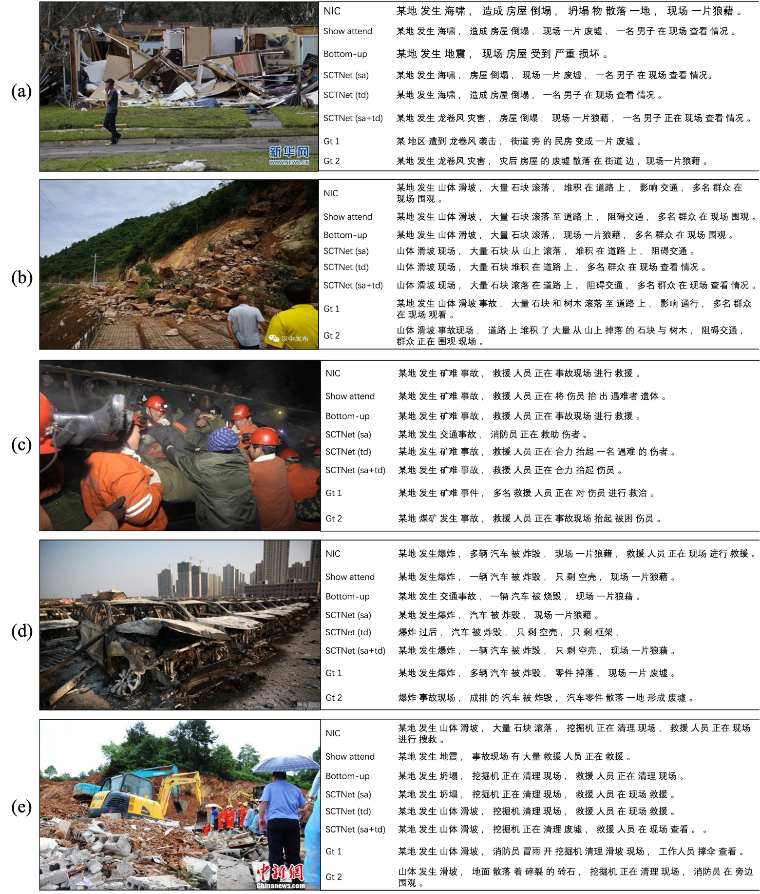

# News-image-caption

most of code in this repository originate from [self-critical](https://github.com/ruotianluo/self-critical.pytorch)

Chinese image caption generation for breaking news
 
## Requirements
- python3
- torch 1.4.0
- numpy 1.16.2
- coco-caption (see [README](https://github.com/ruotianluo/self-critical.pytorch))
- cider (see [README](https://github.com/ruotianluo/self-critical.pytorch))


## Data preparation
Download the raw data from  [News dataset]()

(1) preprocess the news label
```
python scripts/prepro_news_labels.py --input_json data/news_annotations/annotations/instances_train2017.json --input_json_2 data/news_annotations/annotations/instances_val2017.json --input_json_3 data/news_annotations/annotations/instances_test2017.json --output_json data/newstalk.json --output_h5 data/newstalk
```
(2) preprocess the features
```
python scripts/make_news_data.py
```

## Start training & evaluation
Training
```
python tools/train.py --cfg configs/news.yml --id news_num
```
Eval
```
python tools/eval.py --dump_images 0 --num_images 1900 --model log_news_3/model-best.pth --infos_path log_news_3/infos_news_3-best.pkl --language_eval 1 --beam_size 5
```

**Self critical training**
copy model
```
bash scripts/copy_model.sh news_3 news_3_r
```
training
```
python tools/train.py --cfg configs/news_rl.yml --id news_3_rl
```

## Example
the result of Chinese image caption generation

